## Konsep Single Thread dan Multithread

Single thread berarti program mengeksekusi satu alur instruksi pada satu waktu secara berurutan. Ibarat seseorang yang harus menyelesaikan beberapa tugas satu per satu, program single thread menjalankan setiap operasi secara bergantian. Ini membuatnya sederhana dan mudah dikelola, tetapi bisa menjadi tidak efisien ketika harus menangani tugas-tugas yang berjalan lama, karena program akan terblokir sampai tugas tersebut selesai. Contohnya, jika sebuah aplikasi sedang mengunduh file, pada model single thread, antarmuka pengguna mungkin akan membeku sampai proses unduhan selesai.
Multithread, di sisi lain, memungkinkan program untuk menjalankan beberapa alur eksekusi secara bersamaan dalam satu proses. Setiap thread dapat mengeksekusi bagian kode yang berbeda secara paralel, memanfaatkan sumber daya CPU dengan lebih efisien. Ini seperti tim yang bekerja pada proyek besar, di mana setiap anggota menangani tugas tertentu secara simultan. Dengan multithread, aplikasi dapat tetap responsif selama menjalankan operasi yang membutuhkan waktu lama. Namun, pemrograman multithread lebih kompleks karena perlu menangani sinkronisasi antara thread dan mencegah kondisi race atau deadlock. Meski demikian, aplikasi multithread dapat secara signifikan meningkatkan kinerja pada sistem dengan banyak core processor.

## Visualisasi

```mermaid
gantt
    title Single Thread vs Multithread Execution
    dateFormat  HH:mm:ss
    axisFormat %S
    
    section Single Thread
    Start : 00:00:00, 0s
    Task 1 : 00:00:00, 5s
    Task 2 : after Task 1, 5s
    Task 3 : after Task 2, 5s
    End : after Task 3, 0s
    
    section Multithread
    Thread 1 - Task A : 00:00:00, 5s
    Thread 2 - Task B : 00:00:00, 5s
    Thread 3 - Task C : 00:00:00, 5s
```

    

## Keuntungan & Kerugian
### Singel Thread

**Keuntungan: **
1. Kesederhanaan: Lebih mudah diimplementasikan dan di-debug karena alur eksekusi bersifat linear dan dapat diprediksi.
2. Konsumsi Memori Rendah: Membutuhkan lebih sedikit overhead memori karena hanya perlu menyimpan satu set status eksekusi.
3. Tidak Ada Masalah Sinkronisasi: Bebas dari masalah race condition, deadlock, atau starvation yang umum terjadi pada pemrograman multithread.
4. Konsistensi Data: Karena hanya ada satu thread yang mengakses data, integritas data lebih terjamin tanpa memerlukan mekanisme penguncian.
5. Penjadwalan Sederhana: Tidak memerlukan algoritma penjadwalan thread yang kompleks.

**Kerugian: **
1. Performa Terbatas: Tidak dapat memanfaatkan multiple CPU core, sehingga membatasi kinerja pada sistem multiprocessor.
2. Responsifitas Rendah: Jika melakukan operasi yang memakan waktu lama (seperti I/O), seluruh program akan terblokir hingga operasi tersebut selesai.
3. Pemanfaatan CPU Tidak Optimal: Saat menunggu I/O atau operasi lain, CPU menganggur yang menyebabkan pemborosan sumber daya.
4. Ketahanan Rendah: Jika thread tunggal mengalami kegagalan, seluruh aplikasi akan gagal.
5. Skalabilitas Terbatas: Sulit untuk menskalakan ketika beban kerja meningkat karena keterbatasan satu alur eksekusi.

### MultiThread

**Keuntungan: **
1. Pemanfaatan CPU Lebih Baik: Dapat memanfaatkan multiple core pada CPU modern untuk pemrosesan paralel.
2. Responsifitas Tinggi: Program tetap responsif meskipun sebagian thread sedang melakukan operasi yang memakan waktu.
3. Efisiensi Sumber Daya: Berbagi sumber daya antar thread dalam satu proses lebih efisien daripada antar proses terpisah.
4. Throughput Tinggi: Mampu menyelesaikan lebih banyak tugas dalam interval waktu yang sama.
5. Toleransi Kesalahan Lebih Baik: Kegagalan pada satu thread tidak selalu menyebabkan seluruh aplikasi gagal.

**Kerugian: **
1. Kompleksitas Tinggi: Memerlukan penanganan sinkronisasi dan koordinasi antar thread yang bisa sangat kompleks.
2. Rentan Terhadap Race Condition: Akses bersamaan ke data bersama bisa menyebabkan hasil yang tidak konsisten jika tidak ditangani dengan baik.
3. Potensi Deadlock: Kondisi di mana dua thread atau lebih saling menunggu satu sama lain untuk melepaskan sumber daya.
4. Overhead Manajemen: Pembuatan, penjadwalan, dan sinkronisasi thread menciptakan overhead tambahan.
5. Sulit di-Debug: Masalah pada pemrograman multithread lebih sulit untuk dilacak dan diperbaiki karena perilaku eksekusi dapat bervariasi antar menjalankan program.
